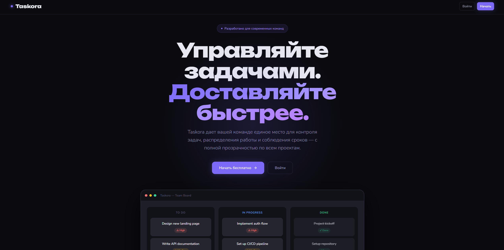
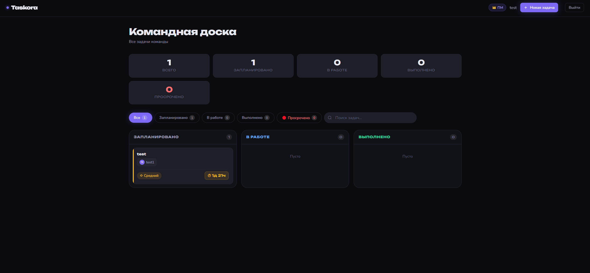
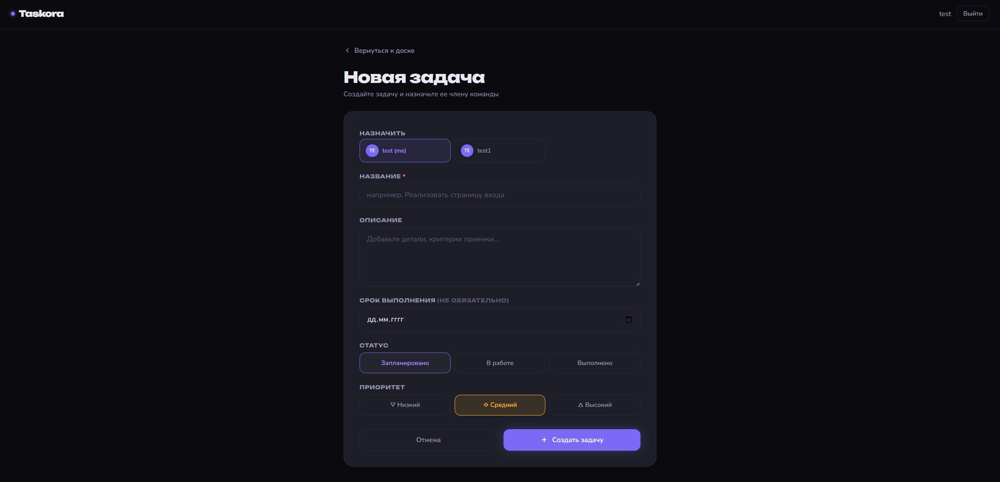
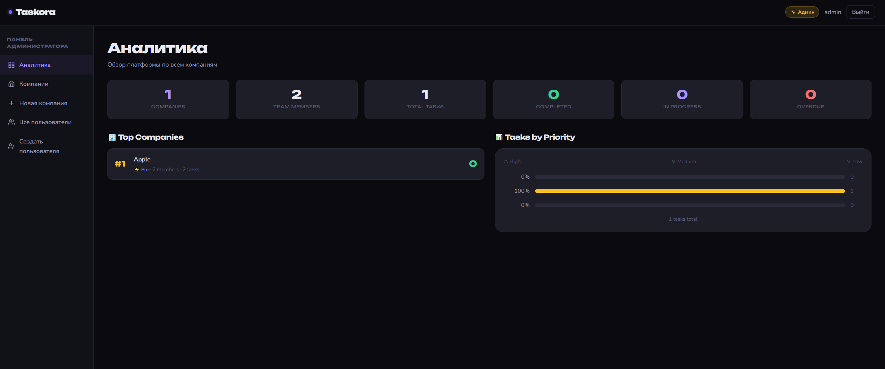

# • Taskora

**Taskora** — система управления задачами для команд с ролевым доступом.



## Стек

- **Backend:** Node.js, Express, SQLite
- **Frontend:** Vanilla JS, HTML/CSS
- **Шрифты:** Unbounded + Nunito
- **Auth:** express-session + bcryptjs

## Роли

| Роль | Возможности |
|------|------------|
| 👤 Сотрудник | Видит свои задачи, берёт неназначенные, меняет статус |
| 👑 ПМ | Создаёт задачи, назначает на сотрудников, видит канбан команды |
| ⚡ Админ | Полное управление компаниями и пользователями |

## Скриншоты

### Панель задач


### Создание задачи


### Панель администратора


## Запуск

```bash
# Установить зависимости
npm install

# Создать .env файл
cp .env.example .env

# Запустить
npm run dev
```

Сервер запустится на `http://localhost:3000`

## .env
PORT=3000
SESSION_SECRET=твой-секретный-ключ
ADMIN_USERNAME=admin
ADMIN_PASSWORD=admin123

## Функции
✅ Таймер обратного отсчёта до дедлайна на каждой задаче
✅ Исполнитель виден прямо на карточке задачи
✅ Сотрудник может взять неназначенную задачу одним кликом
✅ Канбан-доска для ПМ с прогрессом по каждому сотруднику
✅ Invite-коды для регистрации сотрудников в компанию
✅ Полностью на русском языке